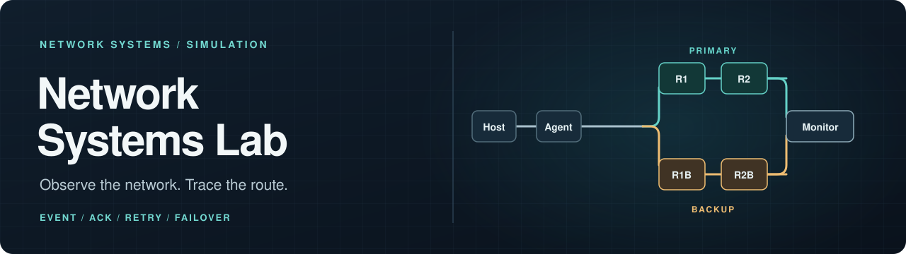

<p align="center">
  
</p>

<p align="center">
  <strong>장애가 생기면 이벤트는 어디로 갈까?</strong><br>
  독립 프로세스 사이의 전달, 확인 응답, 재시도와 우회 경로를 직접 관찰하는 네트워크 수업용 시뮬레이션
</p>

<p align="center">
  
  
  
</p>

<p align="center">
  <a href="#빠른-실행">빠른 실행</a> ·
  <a href="#어떻게-동작하나">동작 방식</a> ·
  <a href="#화면-미리-보기">화면</a> ·
  <a href="#관찰할-수-있는-것">관찰 포인트</a> ·
  <a href="docs/PROJECT_OVERVIEW.md">상세 문서</a>
</p>

---

> **프로젝트 성격:** 실제 운영망의 장애 복구 시스템이 아닌 교육용 데모다. 현재 실행 예시는 한 컴퓨터에서 여러 역할을 독립 프로세스로 띄우는 구성이다.

## 어떻게 동작하나

Host Simulator의 관측값을 Local Agent가 이벤트로 만들고, Relay를 거쳐 Monitor에 전달한다. 각 hop은 ACK를 기다리고 필요하면 재시도한다. 기본 경로의 첫 hop이 실패하면 Agent는 **같은 `event_id`**로 제한된 우회 경로를 시도한다.

```text
                         ┌─ R1 ── R2 ──┐  기본 경로
Host → Local Agent ───────┤             ├─ Monitor
                         └─ R1B ─ R2B ─┘  우회 경로
```

Controller/UI는 이 데이터 경로 밖에서 실행 상태와 장애를 제어한다. 기본 경로와 우회 경로 사이를 임의로 교차하는 전달은 지원하지 않는다.

## 빠른 실행

저장소 루트에서 **Python 3**로 실행한다. 별도 패키지 설치는 필요 없다.

| 화면 | 명령 | 확인할 곳 |
|---|---|---|
| 브라우저 | `python -m web_ui.server --web-port 8080` | `http://127.0.0.1:8080` |
| 터미널 | `python main.py` | 터미널의 Controller/UI viewer |

두 명령 모두 필요한 Host, Agent, Relay, Monitor 역할 프로세스를 함께 시작한다. 브라우저에서는 전체 경로와 노드 상태를 볼 수 있고, 터미널에서는 `viewer>` 프롬프트에서 명령을 입력할 수 있다. 비대화형 터미널에서 `python main.py`를 실행하면 scripted scenario가 자동으로 진행된 뒤 종료된다.

처음에는 브라우저 화면에서 기본 경로를 살펴보고, `pause r1`로 첫 Relay를 멈춰 우회 경로를 관찰해 볼 수 있다. 명령과 상태 해석은 [프로젝트 개요](docs/PROJECT_OVERVIEW.md)에 정리했다.

## 화면 미리 보기

<p align="center">
  
  <br>
  <sub>전체 경로와 노드 상태를 한 화면에서 관찰한다.</sub>
</p>

<details>
<summary>노드 상세 화면 보기</summary>

<p align="center">
  
</p>

</details>

## 관찰할 수 있는 것

| 상황 | 화면에서 볼 수 있는 것 |
|---|---|
| Host 상태 변화와 fault 주입 | Agent의 이벤트 생성과 전달 경로 |
| 정상 전달 | hop별 `EVENT`, `ACK`, Monitor 수신 |
| ACK 손실 또는 지연 | timeout, 최대 3회 재시도, 중복 이벤트 억제 |
| 기본 경로 장애 | R1B → R2B 우회, route trace, 장애 위치 추정 |

`CPU_SPIKE`, `SERVICE_DOWN`, `LATENCY_HIGH`를 주입할 수 있다. Monitor는 최종 수신 상태를 보여주며, 장애 위치는 관측 근거에 따른 **추정**으로 표시한다.

## 구성과 문서

이 저장소는 Python 표준 라이브러리만 사용한다. 역할 간 통신은 TCP 위의 줄 단위 JSON 메시지이며, Web UI는 Controller/Gateway의 상태를 JSON API로 읽는다.

- [프로젝트 개요](docs/PROJECT_OVERVIEW.md): 역할, 메시지, 제어 명령, 포트, 실행 방식
- [터미널 진입점](main.py): 기본 viewer와 역할별 실행
- [Web UI 진입점](web_ui/server.py): 브라우저 화면과 API
- [테스트](tests/): 전달·우회·상태 계약 검증
